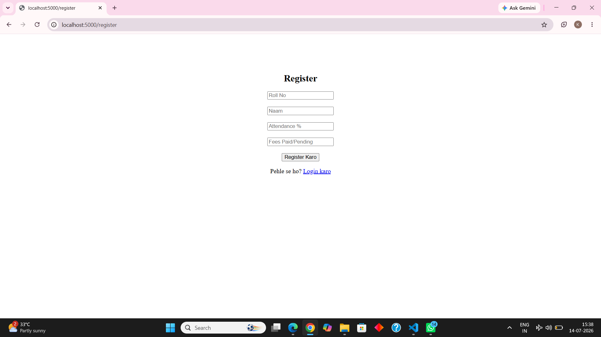
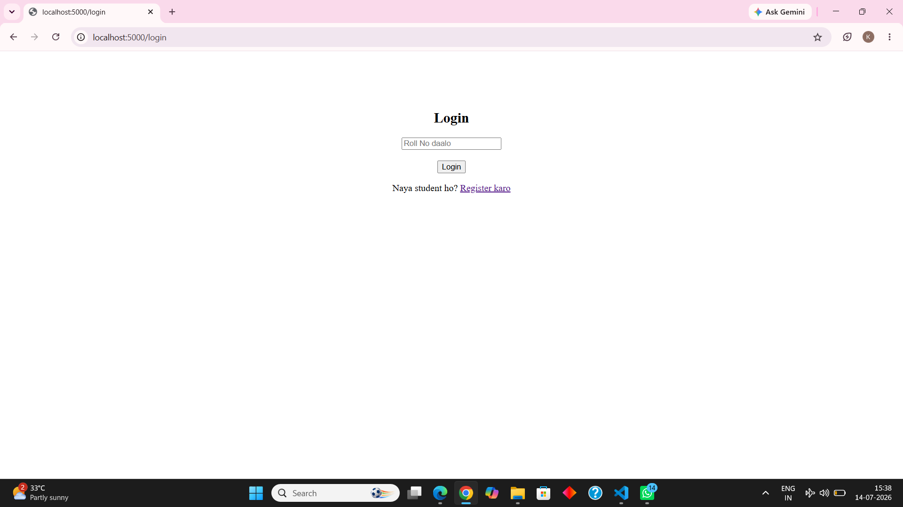
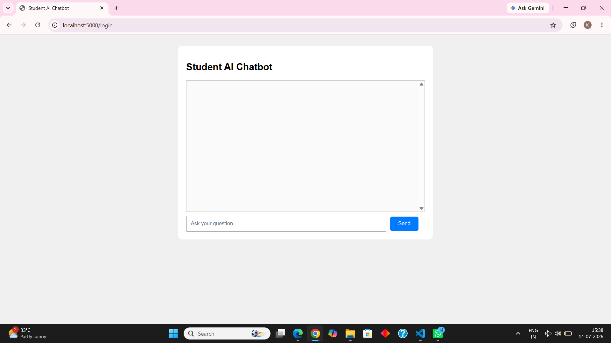

# Student Chatbox

An AI-powered web chatbot for students to get instant information about college, fees, attendance and other queries 24/7.

## Screenshots

### 1. Register Page

*New students can register here with Roll No, Name, Attendance and Fees*

### 2. Login Page

*Already registered students can login using Roll No*

### 3. Chat Interface

*Students can ask questions and get instant answers*

## Features
- ⚡ Instant Response 24/7
- 🧠 Intent Recognition using `intents.json`
- 💾 Database Support using `students.db`
- 🌐 Web-based interface using Flask
- 📝 Register + Login System

## Technologies Used
- **Language**: Python
- **Framework**: Flask
- **Database**: SQLite
- **Frontend**: HTML, CSS

## How to Run
1. Clone the repository
```bash
git clone https://github.com/deepmalanishad28-cmd/student-chatbox
